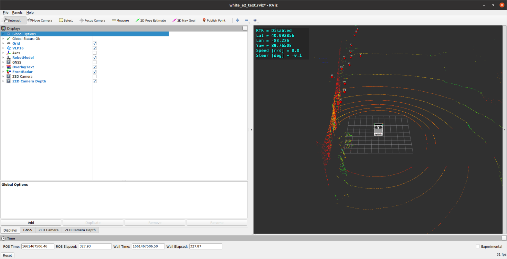
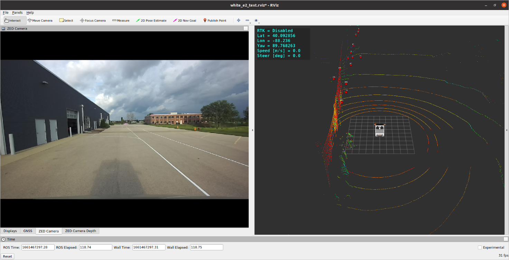

### Starter Code of Polaris GEM e2 for [ECE484](https://publish.illinois.edu/safe-autonomy/) and [CS588](http://luthuli.cs.uiuc.edu/~daf//courses/MAAV-22/588-2022-home.html)
Note that this code is for the e2. If you are working with the e4, DO NOT use the ROS environment included at this directory level; short story is that it won't work. You can use the `demo_ws` folder in the `~` directory, for now
#### Center for Autonomy at University of Illinois Urbana-Champaign

#### Author: Hang Cui (hangcui3@illinois.edu)

#### System: Ubuntu 20.04 + ROS Noetic

#### Polaris GEM e2 Vehicle

  

  

  

#### Demo
Note that this demo is not for lane following and does not use lane detection. Instead, the car will drive autonomously using only GNSS to follow pre-recorded waypoints (similar to the setup of MP2).
The demo code that DOES do lane following using lane detection is within the vehicle_drivers/gem_gnss_control/ directory.

$ cd ~/demo_ws/  
$ catkin_make  

$ source devel/setup.bash  
$ roslaunch basic_launch sensor_init.launch  

$ source devel/setup.bash  
$ roslaunch basic_launch visualization.launch  

$ source devel/setup.bash  
$ roslaunch basic_launch dbw_joystick.launch  

#### GNSS-based waypoints follower with Pure Pursuit controller

Click the video below.  

  

$ source devel/setup.bash  
$ rosrun gem_gnss_control gem_gnss_tracker_pp.py  

#### GNSS-based waypoint follower with Stanley controller and RTK enabled [potentially deprecated]

Click the video below.  

  

$ source devel/setup.bash  
$ roslaunch basic_launch gem_pacmod_control.launch  

$ source devel/setup.bash  
$ rosrun gem_gnss_control gem_gnss_tracker_stanley_rtk.py  

#### Vision based (monovision camera) lane following using Stanley controller

Click the video below (still under development).  

 lane following using Stanley controller")  

